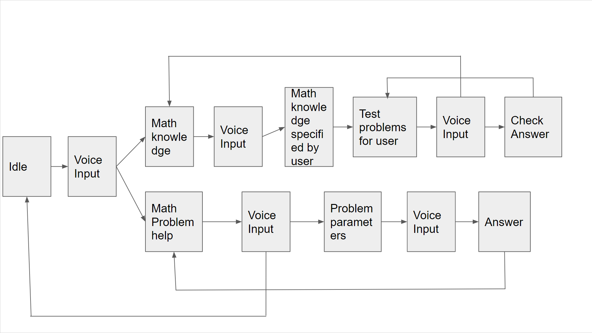

# EC500-MathTutorApp
## Team members
- Jie Lu (jielu666@bu.edu)
- Shengyueshao (shengys@bu.edu)

## User Story
-I, as a student, want to learn math knowledges.
-I, as a student, want to practice math problems after I learned the knowledge
-I, as a student, want to use the application to help me with math problems

## Product Mission
This App is mainly specefic for the user who is willing to learn math knowledge. It helps users(students) to learn math knowledge and provide corresponding math problems for the user to practice. This app can also help user solve simple math problems.

## MVP
-Recognize user’s voice input and convert it to text input
-Provide course via Khan api(Couldn’t get Khan api to work)
-Test user with math problems

## Technology Used
-Python
-JSON
-Speech_recognition api (google voice recognition)

## Structure
 

